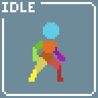
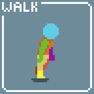
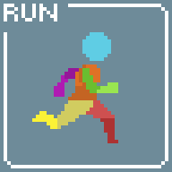
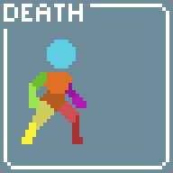
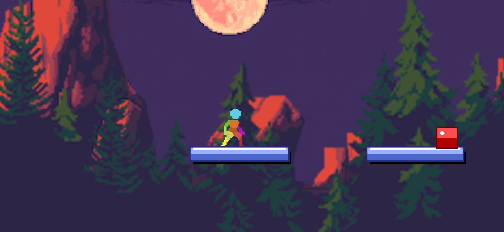

# 🎮 JUMPY - Ein LibGDX Plattformspiel

---

## 📖 Was ist Jumpy?
**Jumpy** ist ein spannendes Plattformspiel, das ich mit dem **LibGDX Framework** entwickelt habe. 
Das Spiel kombiniert klassische Jump'n'Run-Mechaniken mit modernen Spielelementen.

**🎯 Das Besondere:** Es gibt zwei Spielmodi - normale Level und einen endlosen Modus!

---

## 🎮 Spielmodi

### 🎯 **Level-Modus**

- **5 verschiedene Level** mit steigendem Schwierigkeitsgrad
- Jedes Level hat ein Ziel, das du erreichen musst
- Perfekt zum Üben und Verbessern

### ♾️ **Endlos-Modus**  

- **Endloses Spielen** - wie weit schaffst du es?
- Automatisch generierte Level
- Dein Score wird gespeichert

### 🏆 **Bestenliste**

- Speichere deine **Highscores**
- Vergleiche dich mit anderen Spielern
- Versuche, deinen eigenen Rekord zu brechen

---

## ⌨️ Steuerung

- **A/D** oder **Pfeiltasten**: Links/Rechts bewegen
- **Leertaste**: Springen
- **Shift**: Rennen (schneller laufen)
- **M**: Zurück zum Hauptmenü
- **R**: Level neu starten

---

## 🔧 Die drei wichtigsten Techniken im Spiel

---

### 1. 🎬 **Spieler-Animationen**
**Was macht es?**
Der Spieler sieht in verschiedenen Situationen unterschiedlich aus - beim Laufen, Springen, Verletzt werden, etc.

**Wie funktioniert es?**
- Das Spiel lädt automatisch verschiedene "Bilder" (Sprite-Sheets) für jede Aktion
- Es wechselt zwischen diesen Bildern, um eine flüssige Animation zu erzeugen
- Falls etwas schiefgeht, gibt es ein Backup-System

**🎬 Animationen in Aktion:**

**📁 Wichtige Code-Stellen:**
- [`Player.java`](https://github.com/MemeLower/JumpyV5/blob/main/core/src/main/java/com/mygdx/game/Player.java#L95-L130) - **Animationen laden** (Zeile 95-130)
- [`Player.java`](https://github.com/MemeLower/JumpyV5/blob/main/core/src/main/java/com/mygdx/game/Player.java#L140-L170) - **Bilder aufteilen** (Zeile 140-170)
- [`Player.java`](https://github.com/MemeLower/JumpyV5/blob/main/core/src/main/java/com/mygdx/game/Player.java#L309-L335) - **Richtige Animation anzeigen** (Zeile 309-335)

**🖼️ Bilder/Visualisierungen:**
-  - **Idle Animation Sprite-Sheet**
-  - **Walk Animation Sprite-Sheet**  
-  - **Run Animation Sprite-Sheet**
-  - **Death Animation Sprite-Sheet**

---

### 2. 🏗️ **Automatische Level-Erstellung**
**Was macht es?**
Im Endlos-Modus erstellt das Spiel automatisch neue Plattformen und Hindernisse.

**Wie funktioniert es?**
- Das Spiel "denkt sich" neue Plattformen aus, während du spielst
- Es platziert zufällig Hindernisse auf den Plattformen
- Alte Plattformen werden gelöscht, um Speicher zu sparen

**📁 Wichtige Code-Stellen:**
- [`EndlessGameScreen.java`](https://github.com/MemeLower/JumpyV5/blob/main/core/src/main/java/com/mygdx/game/EndlessGameScreen.java#L25-L35) - **Einstellungen für Level-Erstellung** (Zeile 25-35)
- [`EndlessGameScreen.java`](https://github.com/MemeLower/JumpyV5/blob/main/core/src/main/java/com/mygdx/game/EndlessGameScreen.java#L85-L115) - **Neue Plattform erstellen** (Zeile 85-115)
- [`EndlessGameScreen.java`](https://github.com/MemeLower/JumpyV5/blob/main/core/src/main/java/com/mygdx/game/EndlessGameScreen.java#L170-L190) - **Alte Objekte aufräumen** (Zeile 170-190)

**🖼️ Bilder/Visualisierungen:**
- [BILD: Automatisch erstellte Plattformen]
- [BILD: Wie Level-Generierung funktioniert]
- [BILD: Verschiedene Hindernis-Typen]
- [BILD: Prozess der Level-Erstellung]

---

### 3. 🏆 **Bestenlisten-System**
**Was macht es?**
Das Spiel merkt sich deine besten Ergebnisse und zeigt eine Rangliste an.

**Wie funktioniert es?**
- Deine Scores werden in einer Datei gespeichert
- Wenn du dich verbesserst, wird dein alter Score überschrieben
- Die besten Spieler werden in einer Liste angezeigt

**🏆 Bestenliste im Spiel:**

**📁 Wichtige Code-Stellen:**
- [`LeaderboardManager.java`](https://github.com/MemeLower/JumpyV5/blob/main/core/src/main/java/com/mygdx/game/LeaderboardManager.java#L20-L45) - **Score hinzufügen** (Zeile 20-45)
- [`LeaderboardManager.java`](https://github.com/MemeLower/JumpyV5/blob/main/core/src/main/java/com/mygdx/game/LeaderboardManager.java#L65-L75) - **Scores speichern** (Zeile 65-75)
- [`LeaderboardManager.java`](https://github.com/MemeLower/JumpyV5/blob/main/core/src/main/java/com/mygdx/game/LeaderboardManager.java#L75-L83) - **Scores laden** (Zeile 75-83)

**🖼️ Bilder/Visualisierungen:**
- [BILD: Wie Scores gespeichert werden]
- [BILD: Score-Update Prozess]
- [BILD: Speicher-System]

---

## ⚙️ Technische Details

### **LibGDX Framework**
Das Spiel nutzt **LibGDX**, ein beliebtes Java-Spielentwicklungsframework:
- ✅ Funktioniert auf verschiedenen Plattformen
- ✅ Schnelle 2D-Grafik
- ✅ Eingebaute Physik
- ✅ Einfache Verwaltung von Spiel-Assets
